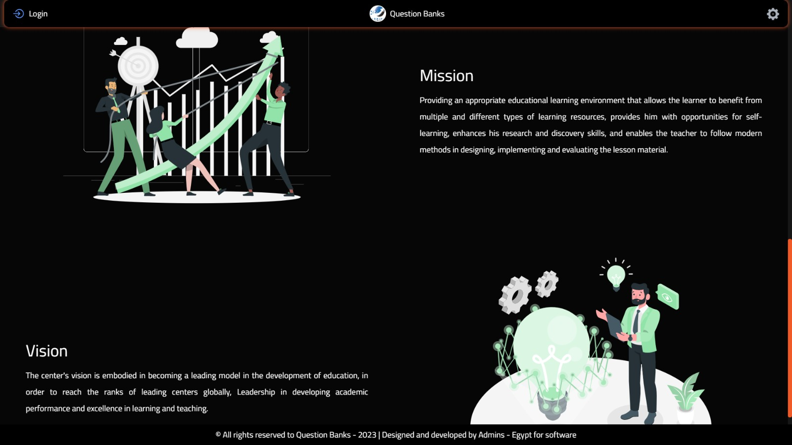
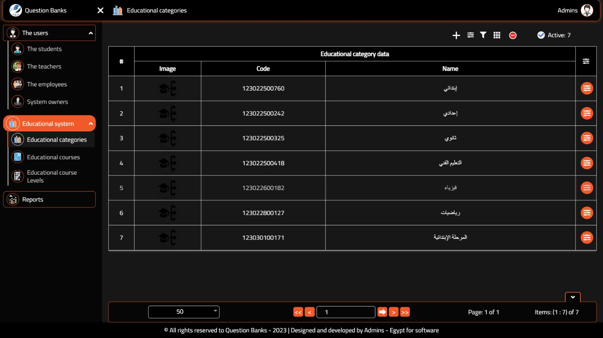
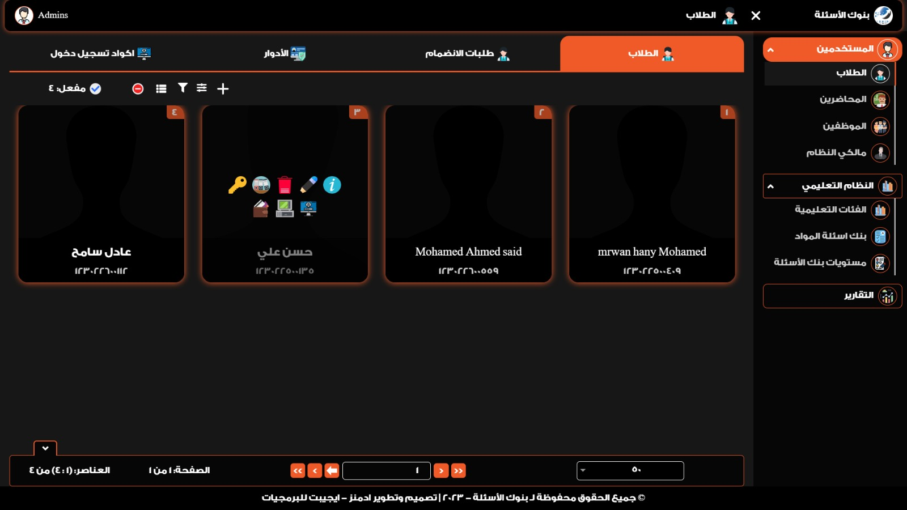

<h1 align="center">Learning Exams System (LXS-DEV)</h1>

- ## Overview:

### System Code: LXS

### System Name: Learning Exams System

### Platform: WEB

### Programming Language: Vue.js (Node.js v14.12.0)

### Project Name: DEV

### Target Group: All Users

--

<p align="center">
  
  
  
  
</p>

---

- ## Features:

### User-friendly interface for managing exams

### Real-time data visualization with Chart.js

### Responsive design for all devices

### Secure authentication and authorization

### Integration with API for backend services

### Multi-language support with vue-i18n

### File management with vue-file-agent

### Calendar integration with v-calendar

- ## Technologies Used:

### Vue.js

### Node.js

### Chart.js

### Firebase

### Bootstrap & Bootstrap-Vue

### Axios

### ESLint for code linting

### Babel for JavaScript compilation

### Project setup

<p align="center">
  
</p>

```
npm install
```

### Compiles and hot-reloads for development

```
npm run serve
```

### Compiles and minifies for production

```
npm run build
```

### Run your unit tests

```
npm run test:unit
```

### Lints and fixes files

```
npm run lint
```

### Customize configuration

See [Configuration Reference](https://cli.vuejs.org/config/).

---

### GitHub

```
git add .
```

```
git commit -m 'your message'
```

```
git push origin branch-name
```

---

## Chart.js

#### To run Chart.js

1. Find in "node_modules/vue-chartjs/es/BaseCharts.js"

```
import Chart from 'chart.js';
```

2. Replace it by

```
import Chart from 'chart.js/auto';
```

---

